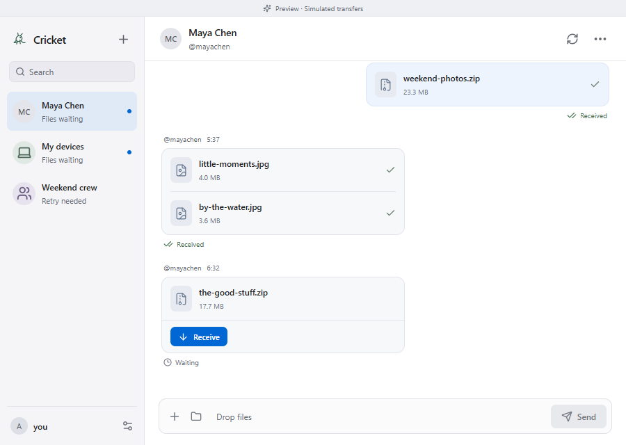

<p align="center"></p>
<h1 align="center">Cricket</h1>
<p align="center">Files, a little closer.</p>
<p align="center">A small desktop app for sharing files with your other devices and your favourite people.<br/>Built with Tauri, powered by croc, with private GitHub chats and delivery receipts.</p>

> **Preview 0.1.2.** [Download for Windows or Linux](https://github.com/eddieyzhan/Cricket/releases/tag/v0.1.2). Includes public-relay checks and clearer transfer failures. [Mac preview 0.1.1](https://github.com/eddieyzhan/Cricket/releases/tag/v0.1.1) · [Verification details](docs/VALIDATION.md).



## The idea

Choose a chat. Drop your files. Click **Send**.

The other person gets a desktop notification, opens Cricket, and clicks **Receive**. Your chat keeps a history of files and receipts: waiting, seen, receiving, received, or retry needed. Group chats track each recipient separately.

- **Files and folders.** Drag and drop, or use native file/folder pickers.
- **My devices.** Sign into the same GitHub account on two computers and create a chat with no other members.
- **Saved people.** Usernames from your chats are remembered on this device. Search and select them when starting another chat or group. They are cleared when you disconnect your account.
- **People and groups.** Create a chat with GitHub usernames. Cricket creates a private repository and invites those people.
- **Durable receipts.** Offers are GitHub issues; receipts and retry requests are append-only comments. Failed receipt writes wait in a local outbox.
- **An actual small desktop app.** Tauri uses the operating system webview. React handles the interface; Rust owns credentials, networking, and processes. There is no bundled Chromium or Node runtime.
- **Made for agents too.** Semantic controls, keyboard access, descriptive labels, stable test IDs, and an authenticated local JSON API with a zero-dependency Node CLI.

GitHub stores **filenames, sizes, participants, expiring croc codes, and receipts**. File contents are sent by croc and are never uploaded to the chat repository. Chat members and GitHub can read this metadata, including the transfer codes. A private chat is a trust boundary, not encryption of metadata from GitHub.

## Use Cricket

1. Install a build from [Releases](https://github.com/eddieyzhan/Cricket/releases), or build locally below.
2. Connect GitHub. This preview can reuse an existing **GitHub CLI** login, or save an access token in your operating system's credential vault. A classic token with `repo` scope supports chat creation and invitations; this scope grants broad private-repository access.
3. Click **New chat** and select saved people or add a GitHub username. Choose **My devices** with nobody selected. Group names are optional.
4. Friends accept their invitation in Cricket or on GitHub, then refresh. The chat appears automatically on their devices.
5. Choose that chat, add files, and click **Send**. The receiver chooses a download folder. Cricket creates a unique subfolder for each receive attempt, avoiding overwriting existing files.

The pinned croc **11.5.3** executable is included in packaged builds. You do not need to install croc separately.

**Keep the sender and receiver online during a transfer.** A new offer waits for up to 15 minutes. Once croc reports data progress, the process allows up to 24 hours for the transfer. Cricket uses encrypted croc relay transfers; it does not provide offline file storage. Closing the window keeps Cricket in the tray for polling and notifications. Use the tray menu to quit.

Notifications are polled: normally every 30 seconds while the window is visible, 90 seconds in the tray, and 120 seconds after a sync error. Chat discovery runs every five minutes or immediately on manual refresh. OS notification settings still apply.

### When something stops

Version 0.1.2 checks a small encrypted round trip before choosing a public
relay, avoiding reachable relays whose transfer handshake fails. Update the
**sending device** and retry there; existing receivers understand the new offer.
Preparing a send can take several seconds while relay candidates are checked.
Failures retain a specific explanation in the chat, without exposing croc output
or transfer codes. See [validation](docs/VALIDATION.md) for the reproduced failure.

The transfer stays in the chat. A recipient can **Ask to resend**, and the original sending device can **Retry**. Retrying generates a new secret and attempt number; old receipts cannot complete the new attempt. Already received recipients are never automatically resent files. Changed or missing source files must be selected as a new transfer. Folder retries check the included paths, sizes, and modification times.

**Sent** means the sender's croc process finished successfully. **Received** means the receiving account published its successful receipt. **Seen** means a chat was opened; it does not claim a person opened the downloaded file. Receipt sync failures do not turn an incomplete transfer into a success.

## Build and develop

Install Node.js **22.12+**, stable Rust, and the [Tauri prerequisites](https://v2.tauri.app/start/prerequisites/) for your operating system. On Windows, Rust must be on `PATH`, and Visual Studio C++ Build Tools plus the Windows SDK are required. On Linux, also install the development packages for Secret Service/D-Bus and OpenSSL (`libdbus-1-dev`, `libssl-dev` on Debian/Ubuntu).

```sh
npm ci
npm run prepare:croc
npm run desktop
```

`prepare:croc` downloads the host platform's official croc release, verifies a SHA-256 pinned in source, and includes the upstream license. Supported build hosts: Windows x64/ARM64, macOS Intel/Apple Silicon, Linux x64/ARM64. Build on the target operating system. Release signing and macOS notarization are not configured in this preview.

```sh
# Browser-only interactive design preview (no real transfers or GitHub writes)
npm run dev

# Local checks
npm run check
npm run audit:privacy
npm run build
cargo test --manifest-path src-tauri/Cargo.toml
cargo clippy --manifest-path src-tauri/Cargo.toml -- -D warnings
node tools/test-croc.mjs

# Package on the current platform
npm run tauri -- build
# Or choose one bundle, e.g. Windows:
npm run tauri -- build --bundles nsis
```

The browser preview is explicitly labelled and uses fictional data. Native builds start with GitHub setup and use the real backend.

The optional packaging workflow is **manual only**. It refuses to run in private repositories, uses standard public runners, and uploads packages directly to an existing draft release. It creates no Actions artifacts or caches and never runs on a push. Windows packaging is performed locally; Linux and macOS builds can be requested together once the local checks pass. Repository Actions are disabled between releases; enable them only for a deliberate packaging run. Standard public runners are [free under GitHub's runner policy](https://docs.github.com/en/actions/reference/runners/github-hosted-runners#standard-github-hosted-runners-for-public-repositories).

### GitHub browser sign-in

Branded browser sign-in uses GitHub's device authorization flow and requires registering a Cricket OAuth app with device flow enabled. Set `CRICKET_GITHUB_CLIENT_ID` **when compiling Rust** to show the **Continue with GitHub** button. No client secret belongs in the app. Builds without this configuration still support GitHub CLI and token sign-in. See [SETUP.md](docs/SETUP.md).

## For AI agents

Read [the agent guide](docs/AGENT.md). With Cricket running:

```sh
node tools/cricket.mjs status
node tools/cricket.mjs send --chat alice/cricket-abc123 --file /absolute/path/photo.jpg
node tools/cricket.mjs receive --transfer alice/cricket-abc123#1 --directory /absolute/path/Downloads
```

Use exact repository and transfer IDs from `status`; never guess a recipient from a similar name. Successful command submission starts a transfer. Inspect the delivery receipt to confirm completion.

## Design and boundaries

See [architecture and protocol](docs/ARCHITECTURE.md) and [security notes](SECURITY.md).

Current limits: ten people per chat, ten simultaneous local deliveries, 200 selected top-level items per transfer, 100,000 entries per selected folder, and 2,000 entries per GitHub list. Very large histories will eventually need archiving. GitHub outages delay invitations, offers, and receipts. A group sends one copy per recipient. This is file sharing, not a messaging service or an unattended folder sync tool.

MIT licensed. [croc](https://github.com/schollz/croc) is MIT licensed by Zack Scholl and contributors. Cricket is an independent project, not affiliated with GitHub or croc's maintainers.
