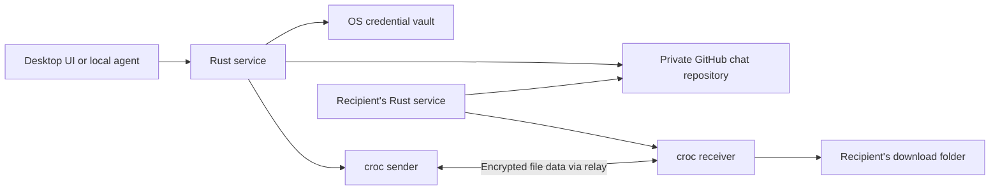

# Architecture



The same validated Rust methods serve Tauri commands and the loopback agent API. The renderer gets sanitized snapshots without access tokens, croc codes, or source paths. Browser previews use a separate, explicitly labelled in-memory adapter.

## One private repository per chat

New repos are named `cricket-<random identifier>`, with description `Cricket private chat · v1`. The description supports discovery without scanning unrelated repositories' contents. The `.cricket/chat.json` manifest contains the display name and up to ten GitHub logins. It is validated on import and before transferring. The repository must be private; changing visibility stops further Cricket writes and reads of transfer data until it is private again. This cannot undo metadata that has already become public.

Members are GitHub collaborators with write permission. They can read all metadata in the chat. A group has one shared history and one independent croc process/code per recipient. A chat with one member targets another device signed into the same GitHub account. Its receipt means one of those other devices received it, not every device on the account.

## Transfer protocol v1

A GitHub issue body starts with `<!-- cricket-transfer:v1 -->` followed by JSON:

- `id`: UUID for the transfer.
- `sender`: the issuing GitHub login, checked against the actual issue author and chat members.
- `source_device`: local device UUID; `device_name`: human-readable source device label.
- `created_at`, `expires_at`: Unix seconds, with a maximum 15-minute initial offer window.
- `files`: names, sizes, and directory flags. Absolute source paths never leave the sender.
- `slots`: recipient login and random croc bearer code for each independent delivery.

An issue comment begins with `<!-- cricket-event:v1 -->` followed by an event:

- `id`: random event UUID, used for deduplication.
- `recipient`, `attempt`, `status`, `at`.
- `code` and `expires_at`: populated only on sender-created retry offers (`waiting`).

The **actual GitHub comment author** determines authority. The sender can publish a fresh attempt or `sent`; only the addressed receiving account can publish `received`, `seen`, `receiving`, or `retry_requested`. Both endpoints can report failure/cancellation. A received receipt is terminal for that recipient. Events from stale attempts and unrelated authors are ignored. Events use GitHub's comment order; client timestamps do not determine authority or ordering.

The reducer recognizes:

```text
waiting -> seen -> receiving -> received
    |          |          |
    +----------+----------+-> failed / cancelled / expired
                                  |
                             retry_requested
                                  |
                   waiting (new attempt + new code)
```

The sender reports `sent` when its croc process exits successfully; the receiver independently reports `received`. These can arrive in either order. A receiving event extends the displayed deadline for long transfers. croc progress markers independently extend the process deadline; raw subprocess output is discarded so secrets cannot reach logs or UI.

## Local durability and process ownership

State is saved atomically as `state.json` in the application-data directory. It contains cached metadata, source paths, an in-flight journal, and an outbox of pending receipts. Events enter the durable outbox before GitHub writes. If a response is lost after GitHub accepted a comment, its UUID lets readers deduplicate a subsequent retry. Startup turns locally interrupted jobs into failed receipts; it never auto-resends files. Source fingerprints check path entries, sizes, and modification times before manual retries; this is change detection, not cryptographic content authentication.

croc runs without a shell. Inputs are validated filesystem paths and fixed argument lists. Secrets are supplied using `CROC_SECRET`, never command-line arguments or clipboard. The pinned binary is checked at packaging time. Downloads go into a newly created unique directory, and files are not executed or opened automatically. Closing the window hides it; quitting cancels child processes and gives receipt writes a bounded flush window.

## Polling and limits

No GitHub Actions, hosted Cricket server, database service, or webhook endpoint is required. GitHub requests use conditional ETags. Unchanged transfer issues reuse parsed comment histories, reducing per-chat polling calls. API failures back off. Discovery and repository pagination stop with an explicit error after 2,000 items rather than silently omitting data. Larger histories will need an archive/pagination interface in a later version.

## Next steps

- Validate native Linux and macOS builds and notification activation.
- Register the project's OAuth application for a consistent browser sign-in experience.
- Sign Windows/macOS releases and add a verified update mechanism.
- Provide explicit device targeting for accounts with several devices.
- Explore optional offline storage using newer croc capabilities, with clear storage/trust/quota choices.
- Add history archiving and more efficient synchronization for very large chats.
